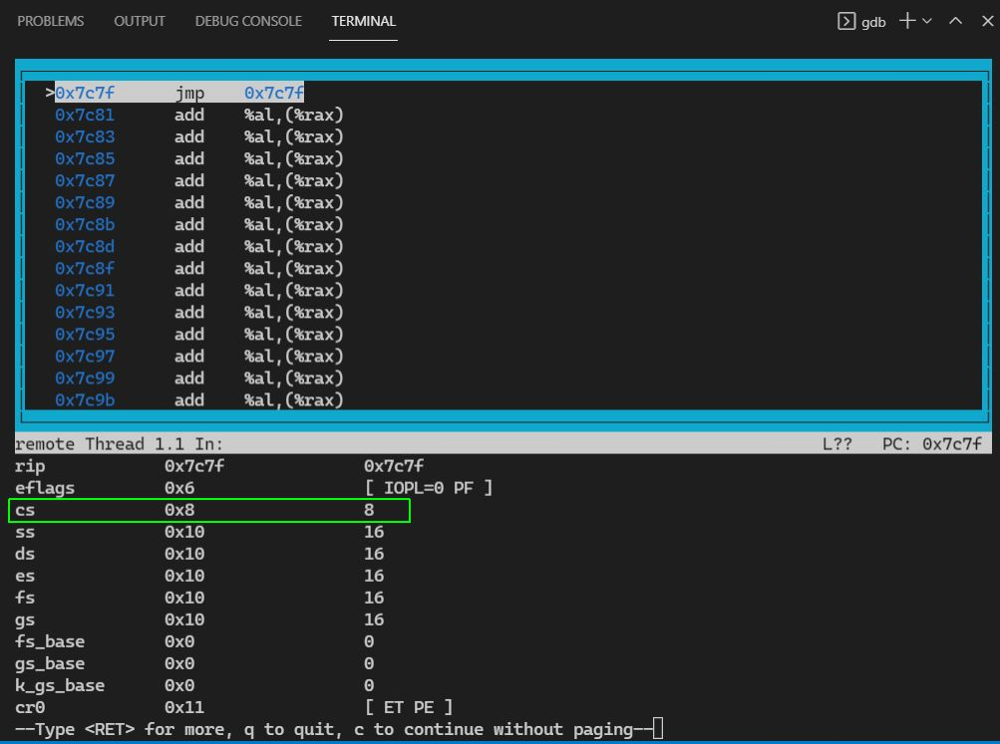
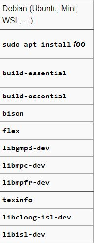
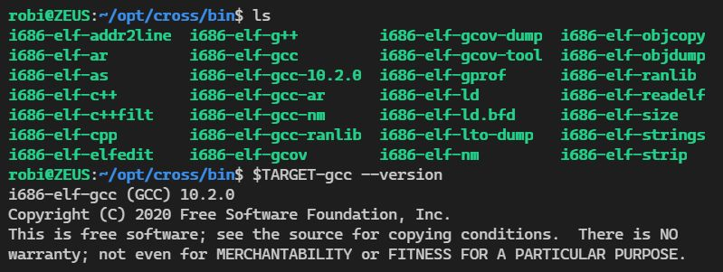
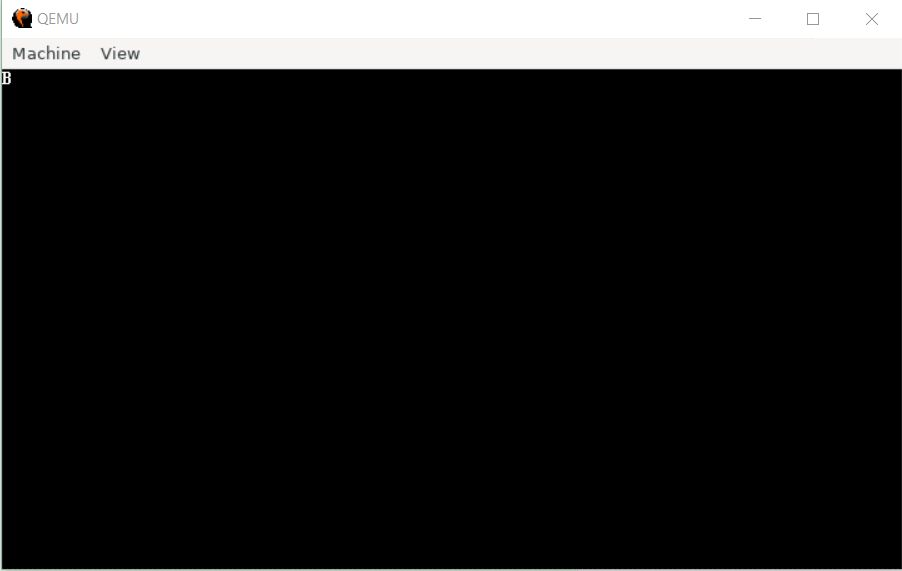
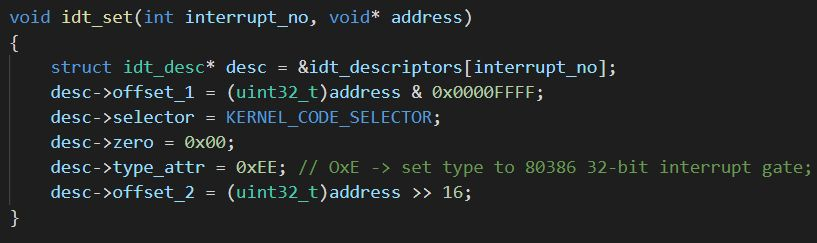
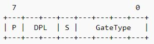
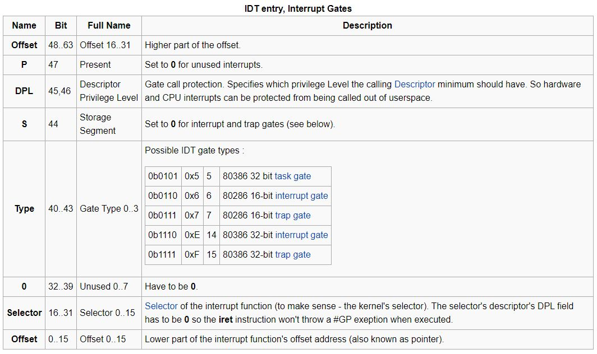

# Peach OS
## Overview
- Multithreaded kernel

## Enable [protected mode](https://wiki.osdev.org/Protected_Mode)
- Check protected mode enabled:

`gdb`

`target remote | qemu-system-x86_64 -hda ./boot.bin -S -gdb stdio`

`Ctrl+C`

`layout asm`

`info registers`

- After enabling protected mode, the kernel is running in 32bit mode, we can no longer access the BIOS. We need to write a disk driver if we want to read from the disk.

## [Creating a cross compiler](https://wiki.osdev.org/GCC_Cross-Compiler)
- A cross-compiler is needed for operating system development. This compiler that we build here will have a generic target `(i686-elf)` what allows you to leave the current operating system behind, meaning that no headers or libraries of your host operating system will be used.
- Install the following packages:

- [Download GNU bin utils](https://ftp.gnu.org/gnu/binutils/binutils-2.35.tar.xz)
- [Download GCC](https://ftp.igh.cnrs.fr/pub/gnu/gcc/gcc-10.2.0/)
- Unzip the archives to your `home/src` folder and follow the instructions on the page to build and install binutils and gcc.
Note that it might needed to make `./configure`, `./move-if-change` and `mkheader.sh` in gcc source code executable for the build to succeed using `chmod +x`.
- If everything is going well, at the end the cross compiler should be available in your `~/opt/cross` directory:

## [Writing to the screen](https://wiki.osdev.org/Printing_to_Screen)
- The text screen video memory for colour monitors resides at `0xB8000` (for monochrome monitors it is at address `0xB0000`).

- Text mode memory takes two bytes for every "character" on screen. One is the ASCII code byte, the other the attribute byte. The attribute byte carries the foreground colour in its lowest 4 bits and the background color in its highest 3 bits.

- [See this commit](https://github.com/robertrancz/peach-os/commit/07da95612874e459a2ed84861b0203b9a4269170) and the result:

## [Interrupt Descriptor Table](https://wiki.osdev.org/Interrupt_Descriptor_Table)
- Describes how interrupts are invoked in protected mode
- The interrupt descriptor structure is set up as follows:

- Note that `type_attr` sets the following bits in the IDT:

- The IDT structure:

- So, basically `type_attr` will set the following:
    - 0xE for `Type` which is for 80386 32-bit interrupt gate as specified in the table above
    - 0xE for S, DPL and P. 0xE = 0b1110, which means we set S->0, DPL->11 and P->1. Note that DPL is set to 0b11 = 3. (See [ring 3 privilege level](https://en.wikipedia.org/wiki/Protection_ring))

